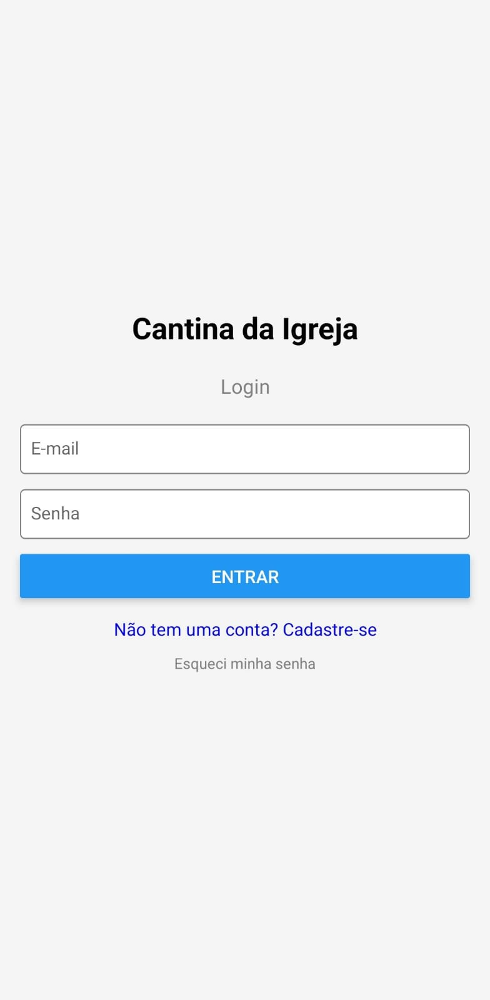
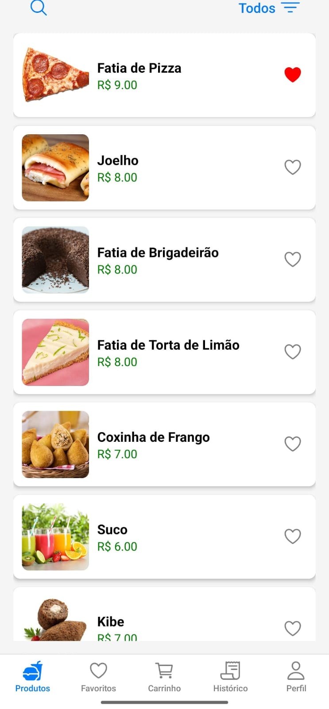
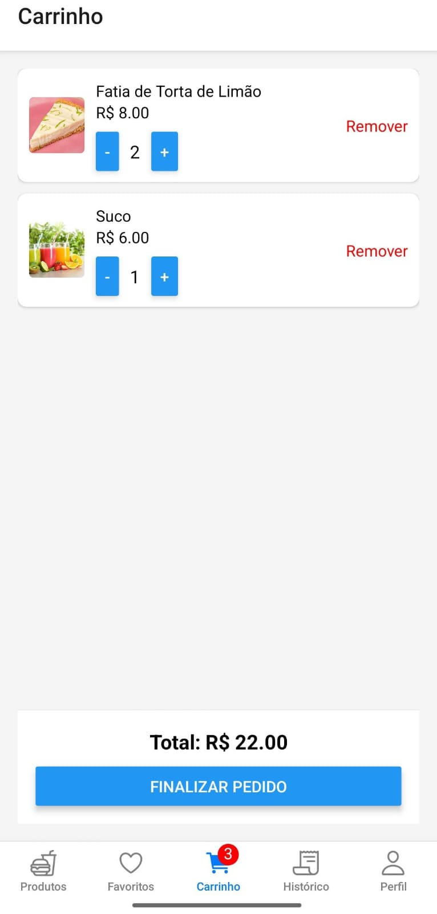
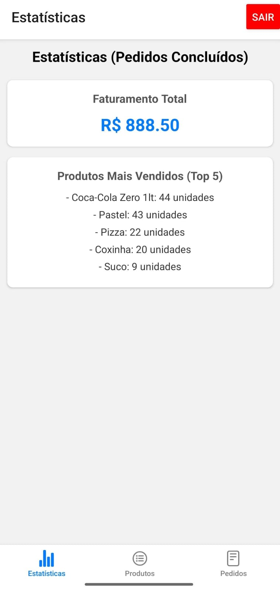

# 🍔 App de Gestão de Cantina (Cantina da Igreja)

> Projeto de Extensão Universitária - Universidade Estácio de Sá (2025)

## 📖 Sobre o Projeto

Este aplicativo foi desenvolvido como parte de um projeto de extensão universitária da disciplina **Programação para Dispositivos Móveis em Android**.

O objetivo principal foi solucionar o problema de **congestionamento e longas filas** na cantina da Igreja Sara Nossa Terra após os cultos. O aplicativo oferece uma solução de autoatendimento móvel, permitindo que os membros façam pedidos antecipados e que a administração gerencie o fluxo de vendas e estoque em tempo real.

**Resultados Alcançados:**
* Redução nas filas e no tempo de espera.
* Organização dos pedidos via sistema digital.
* Controle de estoque automatizado.

## 📱 Funcionalidades

O sistema possui dois perfis de acesso: **Usuário Comum** e **Administrador**.

### 👤 Usuário (Membro)
* **Autenticação:** Cadastro e Login via E-mail/Senha.
* **Catálogo:** Visualização de produtos com imagens, preços e estoque.
* **Busca e Filtro:** Pesquisa por nome e filtragem por categorias.
* **Carrinho:** Adição de itens, controle de quantidade e validação de estoque em tempo real.
* **Favoritos:** Lista de produtos preferidos.
* **Histórico:** Acompanhamento do status dos pedidos realizados (Pendente/Concluído).

### 🛡️ Administrador (Gestão)
* **Dashboard:** Estatísticas de vendas (Faturamento total e Top 5 produtos mais vendidos).
* **Gestão de Produtos:** Adicionar, editar e excluir itens do cardápio.
* **Gestão de Estoque:** Alertas visuais de produtos com baixo estoque (< 5 unidades).
* **Controle de Pedidos:** Visualizar pedidos recebidos e alterar status para "Concluído".

## 🛠️ Tecnologias Utilizadas

* **Frontend:** [React Native](https://reactnative.dev/)
* **Plataforma:** [Expo](https://expo.dev/)
* **Backend (BaaS):** [Google Firebase](https://firebase.google.com/)
    * *Firestore Database* (Banco de dados NoSQL em tempo real)
    * *Firebase Authentication* (Gestão de usuários)
* **Navegação:** React Navigation (Stack & Bottom Tabs)
* **UI/UX:** React Native Paper & Vector Icons


## 📸 Screenshots

| Login | Home | Carrinho | Admin |
|:---:|:---:|:---:|:---:|
|  |  |  |  |


## 🚀 Como Rodar o Projeto

### Pré-requisitos
* Node.js instalado.
* Conta no Firebase configurada (ou use as chaves de teste).

### Instalação

1. Clone o repositório:
   ```bash
   git clone [https://github.com/Kallutt/Projeto-Cantina-Igreja.git](https://github.com/Kallutt/Projeto-Cantina-Igreja.git)
   
> Projeto de Extensão Universitária - Universidade Estácio de Sá (2025)
